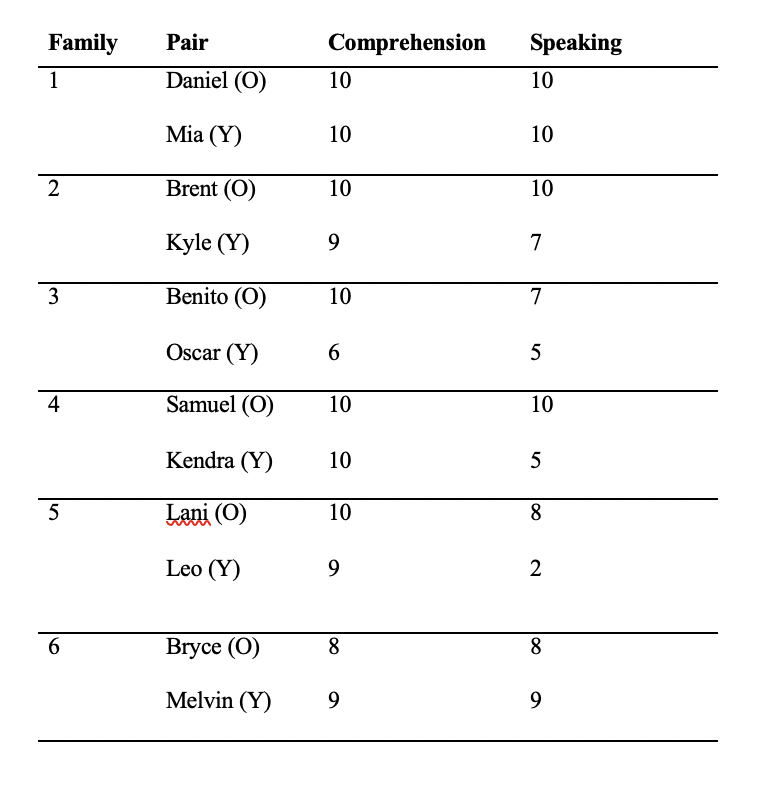
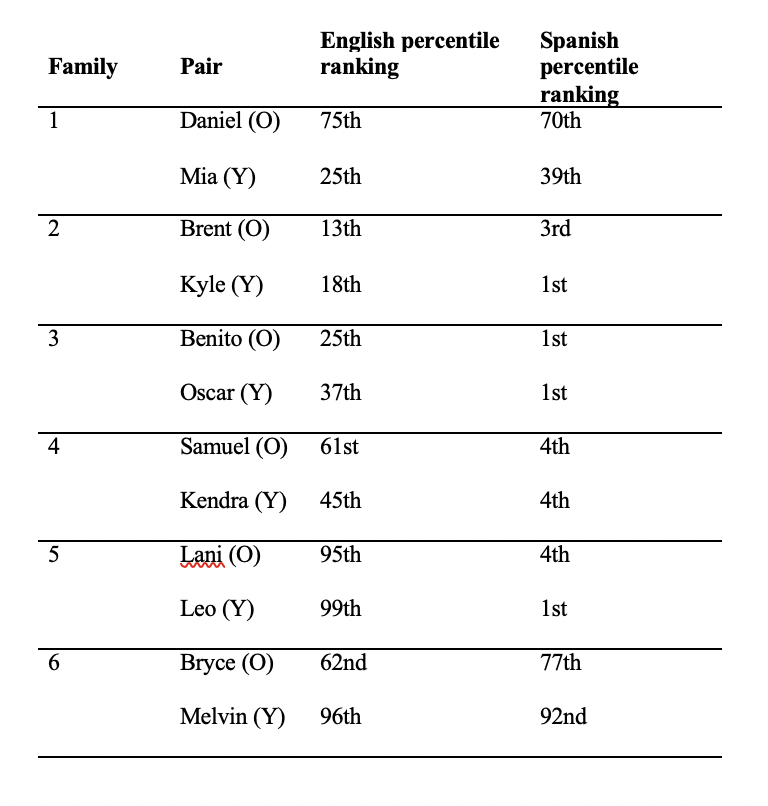
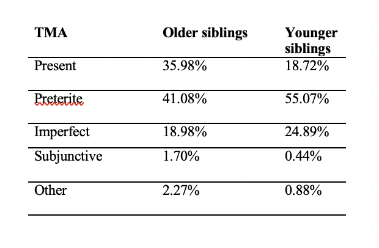
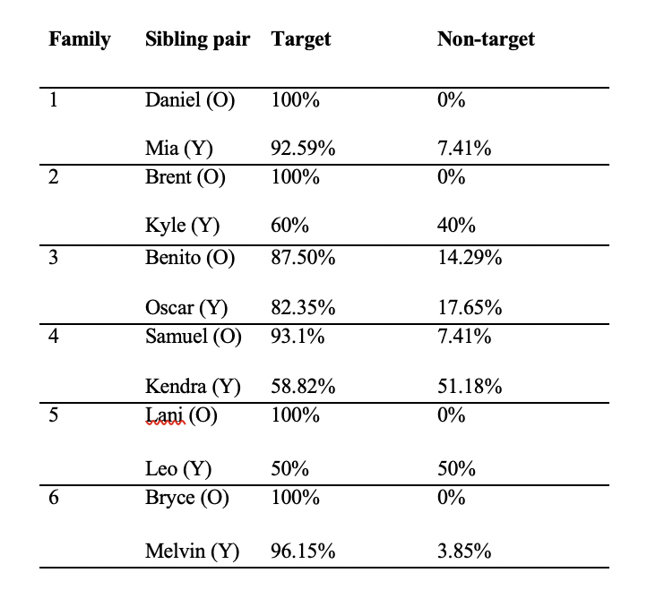
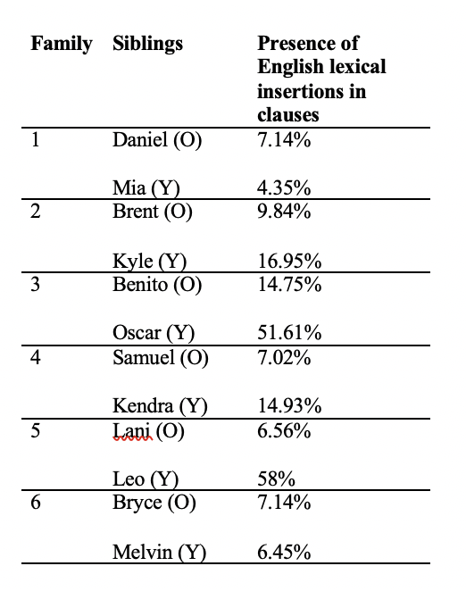

# Language Plots

I am trying to make four plots, which take the original tables and put them into a publishable ready visualization. The goal is as follows: take the tables and produce into a coherent plot that captures both *family* and *sibling* differences. I have made initial attempts in the R markdown file, but would appreciate further guidance to put these tables into a publishable visualzation. 

## Plot 1: Bar chart (stacked )

For the first plot, I think using a bar chart and faceting by family will be able to capture the two factors (family and sibling) and continuous variables (production and comprehension scores). Ggplot2 doesn't like having so many factors, so R file attempts to solve this by adding a separate column for `score type`. But I'd like that the visualization be more professional. 

## Plot 2: Dumbbell Plot

This table compares English scores vs Spanish scores in each sibling pair for families 1-6. I think it would be best to use a dumbbell plot with each side representing English vs Spanish. Another option would be to make this into two plots, one for English and another for Spanish? 

## Plot 3: Dumbbell Plot

Here I also think a dumbbell plot would be most beneficial with each side represented as older vs younger sibling with verb type on Y axis.

## Plot 4: Dumbbell Plot

A dumbbell plot here would be best to show sibling order differences. 

## Plot 5: Stacked Barplot/Dumbbell Plot

For the last plot, I think a stacked barplot or again a dumbbell plot would be best since the goal is to show sibling differences.

